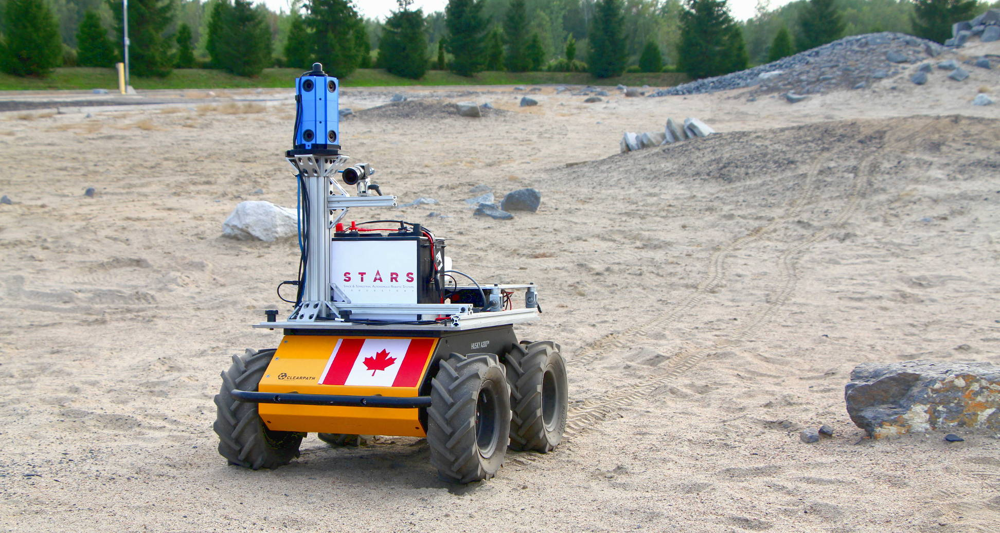

# enav-planetary-dataset

Energy-aware navigation dataset for planetary rovers, collected at the Canadian Space Agency's Mars Emulation Terrain. This dataset amounts to more than 1,200 metres of driving and includes:

* Driving power consumption, solar irradiance on the rover's top plane and clear-sky direct irradiance estimates;
* Panoramic stereo color imagery and high-resolution forward-facing single-channel imagery;
* Tri-axial inertial measurements (acceleration & angular velocities);
* Individual wheel encoder data and corresponding 2D odometry estimates;
* Ground-truth GPS-based position and enhanced pose estimation from IMU, GPS and visual data fusion;
* Sun vector orientation relative to the rover's pose estimates;
* Geo-referenced maps of the environment (RGB mosaic, elevation/slope/aspect models).  



**Authors**: Olivier Lamarre, Oliver Limoyo, Filip Marić, Dr. Jonathan Kelly  
**Affiliation**: [Space and Terrestrial Autonomous Robotic Systems (STARS) Laboratory](www.starslab.ca), University of Toronto  
**Maintainer**: Olivier Lamarre ([email](mailto:olivier.lamarre@robotics.utias.utoronto.ca))

This dataset is described in details in our paper *The Canadian Planetary Emulation Terrain Energy-Aware Rover Navigation Dataset*, submitted to The International Journal of Robotics Research. [Citation instructions](#citation) will follow soon.

## Overview

The data can be downloaded from the dataset's official [web page](http://www.starslab.ca/enav-planetary-dataset/), which contains the data both in human-readable and rosbag format. This repository provides tools to interact with the rosbag files.

Data fetching and plotting alone in generic Python formats can be accomplished using our custom fetching script (which wraps the rosbag module). Advanced data visualization and interaction is enabled using our lightweight ROS package (tested with ROS Kinetic on Ubuntu 16.04):


Lastly, this dataset also includes four different aerial maps of the test environment at a resolution of 0.2 meters per pixel: color, elevation, slope magnitude and slope orientation maps. Every map is georeferenced and is available in a `.tif` format. Tools to import them in ROS as a single [grid_map](https://github.com/ANYbotics/grid_map) message are also included:


## Pre-requisites

1. ROS installation ([ROS Kinetic](http://wiki.ros.org/kinetic/Installation/Ubuntu) tested);
2. Python 3 (version 3.7 tested). We recommend using a Python environment manager like [pyenv](https://github.com/pyenv/pyenv);

## Installation

1. Clone this repository (including the submodules) in the `src` directory of your catkin workspace:

   ```sh
   cd ~/catkin_ws/src
   git clone --recurse-submodules https://github.com/utiasSTARS/enav-planetary-dataset.git
   ```

2. In a Python 3 environment, the required Python 3 modules can be installed using pip and our [requirements file](#):  
   `pip install -r requirements.txt`  

3. Install the required dependencies ([husky_msgs](http://wiki.ros.org/husky_msgs) and [robot_localization](http://wiki.ros.org/robot_localization) ROS packages):

   ```sh
   sudo apt-get update
   sudo apt-get install ros-kinetic-husky-msgs ros-kinetic-robot-localization
   ```

4. Build the enav_ros package:

   ```sh
   cd ~/catkin_ws

   # If you are using catkin build:
   catkin build enav_ros
   source ~/catkin_ws/setup.bash

   # Alternatively, using catkin_make:
   catkin_make --pkg enav_ros
   source ~/catkin_ws/setup.bash
   ```

## Documentation

Documentation on how to fetch & plot the data collected by the rover or how to show our aerial maps (along with sample Python scripts) can be found in the [enav_utilities](enav_utilities) subdirectory. Similarly, instructions related to data visualization using our lightweight ROS package can be found in the [enav_ros](enav_ros) subdirectory.

## Citation

(Coming soon)
